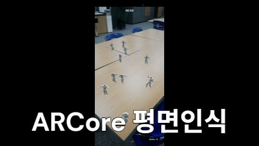

AR 두더지 잡기

  

- AR 공간 매핑: ARCore의 Plane Detection을 활용해 현실 공간의 수평면을 분석하고, 게임 월드의 좌표계와 동기화하여 객체를 정확한 위치에 배치하는 로직 구현.
- 데이터 영속성: USaveGame 클래스를 커스텀하여 로컬 디바이스에 최고 기록 및 유저 데이터를 직렬화(Serialization)하여 저장/로드하는 시스템 구축.
- 입력 처리: 모바일 터치 입력(Screen Space)을 AR 월드 공간(World Space)의 레이캐스트(Raycast)로 변환하여 오브젝트와 상호작용하는 로직 최적화.

- 시연영상 : https://drive.google.com/file/d/1-m0gRI1oZ3awstjGG04gp29PgYnynMhd/view?usp=sharing
