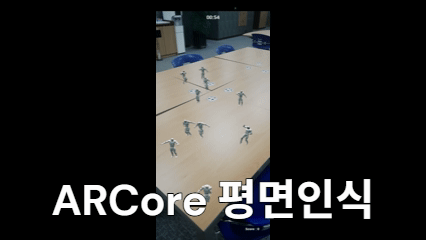

# TouchNPop

기간: 2025.11 ~ 2025.12

교육과정 4인 팀 프로젝트 · Unreal Engine 5 / Blueprint Only / ARCore

ARCore가 감지한 평면 내부에 캐릭터를 생성하고 상호작용하는 Android AR 두더지잡기 프로젝트입니다.

  

## 담당 범위

- AR Plane 자동 식별
- 감지된 평면 내부 무작위 위치 캐릭터 스폰 로직
- SaveGame 기반 저장 기능
- 팀 수정사항 병합

- [시연 영상](https://drive.google.com/file/d/1-m0gRI1oZ3awstjGG04gp29PgYnynMhd/view?usp=sharing)
